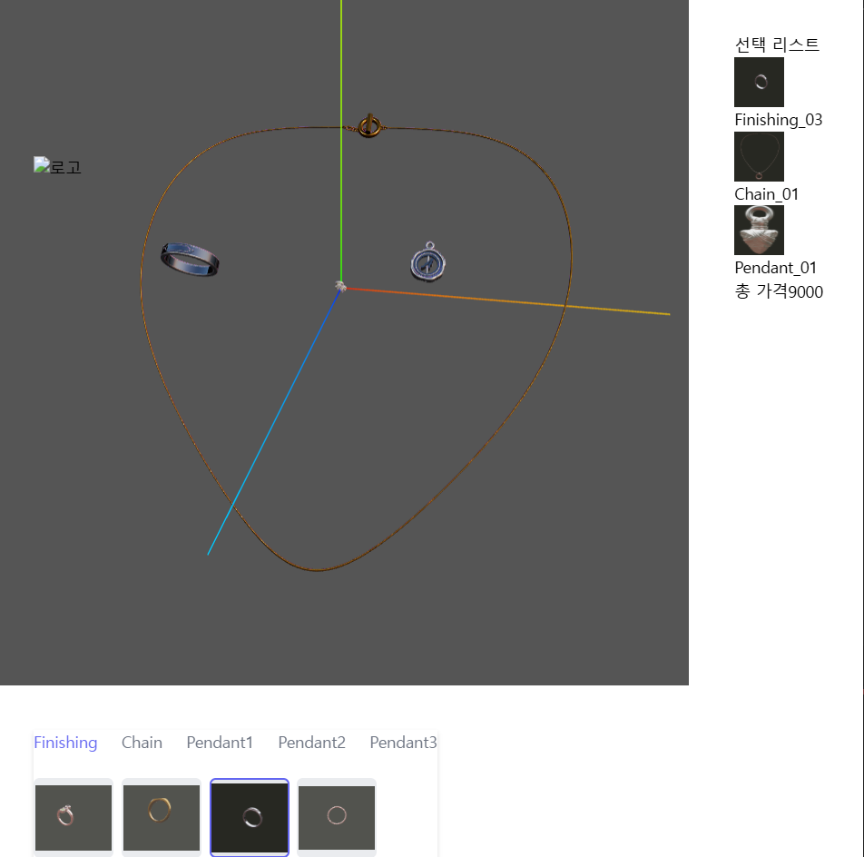
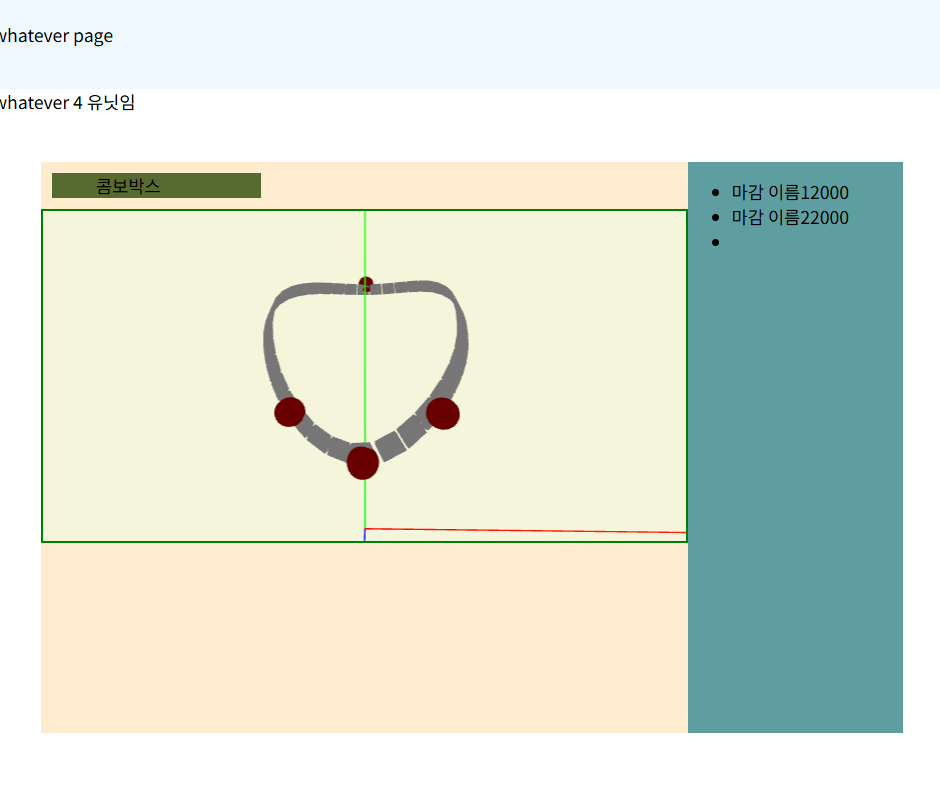

# R3F 공부

## Fashion24 (패션 & 주얼리)

- 프로젝트에서 사용하기 위한, R3F(Three.js) 학습 레포

### 링크
- [Fashion24레포](https://github.com/fashion24-developer/fashion24-front)  
- [또다른 공부 레포](https://github.com/zzzRYT/r3f_study)

## 사진

## 회고

- 팀원 중, 3d 오브젝트를 만들어주는 팀원이 있어서 만들어주긴 했는데, 각 에셋의 위치와 크기가 모두 다른 상황이 발생
- 결국 많은 에셋을 만들지 못한 상태에서 프로젝트가 중단되면서 끝까지 구현하지 못했지만, 구현하면서 Three.js와 R3F에 대해서 많은것을 배울 수 있는 시간이었던 것 같다.
